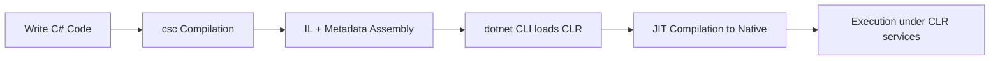

# Module 01: Orientation & Setup

> **Goal:** Understand the .NET ecosystem, install required tooling, and learn how projects are structured and executed. By the end of this module, you will be fully set up to start building .NET applications and tracking your progress.

---

## Learning Outcomes

| # | Outcome | Evidence of Mastery |
|---|---------|---------------------|
| 1 | Explain what the Common Language Runtime (CLR) is and how it manages code execution | Verbal summary or concept map |
| 2 | Differentiate between .NET (Core), .NET Framework, Mono, and .NET Standard | Comparison table you build |
| 3 | Install the .NET SDK, configure IDE/editor, and verify the installation | Screenshot or log of `dotnet --info` |
| 4 | Create, build, and run a basic console application using both CLI and IDE | `HelloWorld` repo in Git |
| 5 | Describe solution/project structure, referencing `.csproj`, `.sln`, and NuGet | Annotated diagram of filesystem |
| 6 | Initialize Git, create first commit, and push to a remote | Repository link with commit history |

---

## Prerequisites

- Basic computer literacy (file navigation, installing software)
- Familiarity with any programming language is helpful but **not required**

---

## Conceptual Foundations

### Understanding the .NET Ecosystem

- **.NET Runtime (CLR):** Manages execution, memory, garbage collection, JIT compilation, exception handling.
- **.NET Framework vs .NET (Core):** Legacy Windows-only vs cross-platform open-source successor. Know lifecycle and why .NET 8 is LTS.
- **.NET Standard:** A specification ensuring binary portability across runtimes; understand why it's less emphasized post .NET 5.
- **Mono & Xamarin/MAUI:** Legacy cross-platform runtime, now integrated into .NET for mobile workloads.
- **Languages:** C#, F#, VB.NET; emphasis on C# for mainstream development and interviews.

### Tooling & SDK Anatomy

- **SDK components:** Compiler (`csc`), runtime, libraries, `dotnet` CLI.
- **Workloads:** Additional templates (e.g., `dotnet workload install maui`).
- **NuGet:** Package manager, feeds (nuget.org, private feeds), semantic versioning.
- **IDEs vs Editors:** Visual Studio (Windows/Mac), VS Code, JetBrains Rider; pros, cons, licensing.
- **Project Structure:** `.sln` (solution aggregator), `.csproj` (project definition), `Program.cs`, `appsettings.json`.

---

## Detailed Notes

### 1. .NET Ecosystem Overview

The **.NET ecosystem** comprises language compilers, the Base Class Library (BCL), managed runtimes, and deployment tooling. Source code is first compiled by the Roslyn compiler into **Intermediate Language (IL)** and stored in assemblies. The **Common Language Runtime (CLR)** loads assemblies, performs **Just-In-Time (JIT)** compilation into native machine instructions, manages memory through the garbage collector, and enforces security boundaries.

- **Unified Platform:** .NET 5+ merges .NET Framework, .NET Core, and Xamarin into a single product, simplifying cross-platform development.
- **Runtime Variants:** Workstation GC (optimized for responsiveness) vs Server GC (optimized for throughput); ready-to-run images precompile IL to native to reduce cold-start.
- **Language Interoperability:** Shared IL means C#, F#, and VB.NET interoperate seamlessly, enabling mixed-language solutions.
- **Release Cadence:** Annual releases, with even-numbered versions being **Long-Term Support (LTS)** (e.g., .NET 8 with support through November 2026).
- **Ecosystem Players:** Mono powers legacy Xamarin and Unity, while CoreCLR drives server and desktop workloads; WebAssembly runtime powers Blazor WASM.

#### Quick Check (5 Questions)
1. What are the responsibilities of the CLR during application execution?
2. Why was the .NET unification (starting with .NET 5) a significant milestone?
3. How do workstation and server garbage collectors differ?
4. What benefits arise from compiling to IL instead of directly to native code?
5. When would you consider using ready-to-run images in deployment?

---

### 2. Tooling and Installation

The **.NET SDK** bundles compilers, the runtime, template packs, and the `dotnet` CLI. Installation workflows differ:

- **Windows:** Use Visual Studio Installer or standalone SDK (x64). Ensure developer features like IIS Express if needed.
- **macOS:** Install via `.pkg` or Homebrew (`brew install --cask dotnet-sdk`), then run `sudo ln -s` to expose the `dotnet` binary if necessary.
- **Linux:** Use Microsoft’s package feeds (`apt`, `yum`, `zypper`) or scripts; ensure dependencies like `libicu`.

Post-install validation:

```bash
dotnet --info
dotnet --list-sdks
dotnet --list-runtimes
```

Editor choices:

- **Visual Studio:** Comprehensive IDE with designers, Live Share, integrated Git, hot reload, and advanced debugging.
- **Visual Studio Code:** Lightweight, cross-platform; rely on extensions (C# Dev Kit, IntelliCode, Thunder Client, Docker).
- **JetBrains Rider:** Commercial IDE with integrated database tools, code inspections, and cross-platform parity.

Workload management:

```bash
dotnet workload list
dotnet workload install maui
dotnet workload update
```

Troubleshooting: Update PATH, restart terminal, or run `sudo dotnet tool restore` when CLI tools are missing.

#### Quick Check (5 Questions)
1. Which command lists all installed runtimes, and why is it useful?
2. Name two differences between Visual Studio and Rider for .NET developers.
3. How would you install the .NET SDK on Ubuntu using Microsoft feeds?
4. When should you consider installing additional workloads, and how do you do it?
5. What steps help resolve a “dotnet command not found” error after installation?

---

### 3. Project Structure Essentials

.NET projects use SDK-style `.csproj` files with minimal XML. Important elements:

```xml
<Project Sdk="Microsoft.NET.Sdk.Web">
  <PropertyGroup>
    <TargetFramework>net8.0</TargetFramework>
    <Nullable>enable</Nullable>
    <ImplicitUsings>enable</ImplicitUsings>
    <UserSecretsId>dotnet-Learn-Module01</UserSecretsId>
  </PropertyGroup>
  <ItemGroup>
    <PackageReference Include="Serilog.AspNetCore" Version="8.0.0" />
  </ItemGroup>
</Project>
```

- **Target Framework Monikers (TFMs):** `net8.0`, `net6.0-windows10.0.19041.0`, etc.
- **Build Configurations:** `Debug` for development (symbols, no optimizations) vs `Release` (optimized).
- **Implicit Usings & Nullable Reference Types:** Introduced in .NET 6+ to reduce boilerplate and improve null safety.
- **Solution Layout:** Keep source under `src/`, tests under `tests/`, docs under `docs/`.
- **Global JSON:** Pin SDK version for reproducible builds (`global.json`).

#### Quick Check (5 Questions)
1. What does setting `<Nullable>enable</Nullable>` do for your project?
2. Why might you need a `global.json` file in a multi-developer environment?
3. How can you target both `net8.0` and `netstandard2.1` in the same project?
4. What folders should never be checked into Git and why?
5. How do implicit global usings help maintain cleaner files?

---

### 4. Working with NuGet

NuGet packages encapsulate reusable libraries. Key concepts:

- **Package Consumption:** `dotnet add package Microsoft.Extensions.Logging` updates `.csproj` with `<PackageReference>`.
- **Package Sources:** Default `nuget.org`, but you can add authenticated feeds via `nuget.config`.
- **Restore Flow:** `dotnet restore` resolves dependencies; `project.assets.json` captures exact versions, enabling deterministic builds.
- **Package Creation:** `dotnet pack` bundles libraries with metadata; include `PackageId`, `Authors`, and semantic version.
- **Security:** Monitor for vulnerabilities using `dotnet list package --vulnerable`.

Example `nuget.config` snippet:

```xml
<configuration>
  <packageSources>
    <add key="nuget.org" value="https://api.nuget.org/v3/index.json" />
    <add key="MyCompanyFeed" value="https://pkgs.dev.azure.com/org/feed/_packaging/Feed/nuget/v3/index.json" />
  </packageSources>
</configuration>
```

#### Quick Check (5 Questions)
1. How do you restrict a project to use a specific pre-release version of a package?
2. What file should you inspect if package resolution suddenly changes?
3. Which command helps surface known vulnerabilities in your dependencies?
4. How do you add a private package source?
5. What metadata should you include when creating your own NuGet package?

---

### 5. Version Control Kickoff

Integrating Git early keeps history and collaboration clean.

```bash
git init
dotnet new gitignore
git branch -M main
git remote add origin https://github.com/you/learn-dotnet.git
git push -u origin main
```

- **.gitignore essentials:** Ignore `bin/`, `obj/`, `.vs/`, `*.user`, `*.suo`, `*.userprefs`.
- **Branching Flow:** Adopt GitHub Flow (feature branches -> PRs -> main) or GitFlow for larger teams.
- **Commit Strategy:** Use conventional commits (`feat`, `fix`, `docs`, `chore`) to automate changelogs.
- **Tagging:** `git tag v0.1.0` + `git push origin v0.1.0` for release milestones.
- **Code Reviews:** Use pull requests for validation; integrate checks like `dotnet format`, `dotnet test`.

#### Quick Check (5 Questions)
1. Why is `.gitignore` critical before your first commit?
2. How does conventional commit syntax assist automation?
3. What is the benefit of tagging releases in Git?
4. Which Git workflow suits small teams practicing continuous deployment?
5. What automated checks should run before merging a pull request in a .NET project?

---

## Hands-On Checklist

### 1. Environment Setup

1. Verify prerequisites:
   - Windows 11 / macOS Sonoma / latest Linux LTS.
   - Hardware: 8GB+ RAM, 10GB free disk.
2. Install `.NET SDK (LTS)`:
   ```bash
   dotnet --info
   ```
3. Pick your primary editor:
   - **Visual Studio** (Community) with workloads: `.NET desktop`, `ASP.NET + web`.
   - **VS Code** with extensions: *C# Dev Kit*, *C#*, *NuGet Package Manager*, *Thunder Client*.
4. Install Git and configure identity:
   ```bash
   git config --global user.name "Your Name"
   git config --global user.email "you@example.com"
   ```
5. Optional: Install **GitHub CLI** (`gh`) for easier repo management.

### 2. First Console Application

```bash
dotnet new console -n HelloWorld
cd HelloWorld
dotnet run
```

- Inspect generated files: `Program.cs`, `.csproj`.
- Modify console message, rebuild, rerun.
- Experiment with `dotnet build`, `dotnet clean`, `dotnet publish`.

### 3. Working with Solutions

```bash
dotnet new sln -n LearnDotNet
dotnet new console -n Module01Demo
dotnet sln add Module01Demo/Module01Demo.csproj
```

- Observe solution/project hierarchy in IDE.
- Add a second project (e.g., `dotnet new classlib`) and reference it via `dotnet add reference`.

### 4. NuGet Package Walkthrough

1. Search NuGet for `Newtonsoft.Json`.
2. Install via CLI:
   ```bash
   dotnet add package Newtonsoft.Json --version 13.0.3
   ```
3. Inspect `.csproj` for `<PackageReference>`.
4. Build and check `obj/project.assets.json`.

### 5. Version Control Initiation

```bash
git init
git status
dotnet new gitignore
git add .
git commit -m "Initialize Module 01 setup"
```

- Push to GitHub/GitLab/Bitbucket: `gh repo create` or manual remote addition.
- Document steps in `SETUP_NOTES.md`.

---

## Visual Reference: Lifecycle of a .NET Application



---

## Practice Lab

> **Objective:** Produce a README-quality document explaining your environment.

1. Clone your own repository (`git clone`).
2. Run `dotnet new console` inside `src/GettingStarted`.
3. Add `README.md` documenting:
   - Installed SDK version (`dotnet --list-sdks`).
   - IDE extensions.
   - CLI commands practiced.
   - Common issues encountered & fixes.
4. Commit with message `docs: document initial setup`.
5. Tag release `v0.1.0` to mark completion.

---

## Interview Check-In

- “What problem does the CLR solve compared to native execution?”
- “Why was .NET Core created? How is it different from .NET Framework?”
- “How do you install a specific SDK version and verify it?”
- “What does the `dotnet build` command produce, and where?”
- Conduct a mock 5-minute whiteboard explaining .NET components.

---

## Troubleshooting Reference

| Symptom | Possible Cause | Resolution |
|---------|----------------|------------|
| `dotnet` command not found | PATH not updated | Reopen terminal or add SDK path manually |
| Build fails with missing workloads | Template not installed | `dotnet workload list` + install required |
| IDE not detecting SDK | Multiple SDK versions | `global.json` to pin version |
| Git showing LF/CRLF warnings | Windows line endings | Configure `.gitattributes` |

---

## Extension Ideas

- Install Docker Desktop and try `mcr.microsoft.com/dotnet/sdk:8.0` container.
- Explore JetBrains Rider trial to compare debugging features.
- Set up WSL2 on Windows and run `dotnet` inside Linux environment.

---

## Reflection & Self-Assessment

1. Can you draw the .NET architecture from memory?
2. Did you automate setup with a script or documentation?
3. Record a 2-minute screen capture demonstrating `dotnet` commands.
4. Update a learning journal with key insights and remaining questions.

---

## Resources

- [Official .NET Download](https://dotnet.microsoft.com/download)
- [dotnet CLI overview](https://learn.microsoft.com/dotnet/core/tools/)
- [NuGet Package Explorer](https://nuget.info/)
- [JetBrains Rider vs Visual Studio comparison](https://www.jetbrains.com/rider/features/)
- [GitHub Docs: Getting started with Git](https://docs.github.com/get-started)

---

## Hindi Video Tutorials

- [.NET Introduction in Hindi – CodeWithHarry](https://www.youtube.com/watch?v=3e_6Yy4v4Uw)
- [Install .NET SDK and Visual Studio in Hindi – WsCube Tech](https://www.youtube.com/watch?v=s6z2Xq-8Bfc)
- [Git & GitHub Crash Course in Hindi – Thapa Technical](https://www.youtube.com/watch?v=APypuG3EwGk)

---

> ✅ **Completion Criteria:** Environment verified, source control initialized, and you can confidently explain how .NET executes your first program. Document everything in your learning log to prepare for deeper modules.

